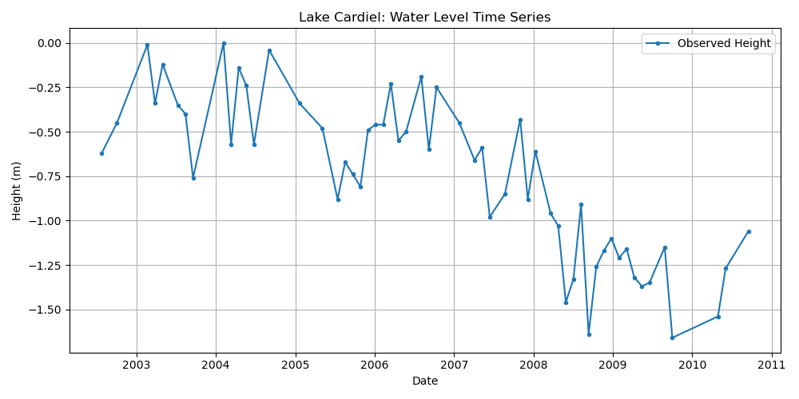

# G-REALM Lake Altimetry Toolbox

A Python toolkit for **downloading, extracting, and structuring global lake water level time series** from the [G-REALM database](https://ipad.fas.usda.gov/cropexplorer/global_reservoir/), maintained by USDA-FAS in collaboration with NASA, CNES, ESA, and other space agencies.

---

## Overview

This repository provides scripts to:
- **Download** lake water level time series from the G-REALM database (multiple sampling rates).
- **Extract** and **structure** the raw data into an analysis-ready format.
- **Visualize** the time series for each lake.

The toolkit supports rapid exploration and reproducible extraction of satellite altimetry data for global lakes, suitable for hydrological research and scientific publications.

---
<br>

## Project Structure

``` .
├── Toolbox.ipynb # Utilities and helper functions
├── dln_GREALM.ipynb # Main notebook: download, extract, and structure data
├── README.md # Project documentation (this file)
├── Cardiel.png
└── .gitattributes # Git configuration attributes
``` 
<br>


- `Toolbox.ipynb`: Contains utility functions for analysis and visualization.
- `dln_GREALM.ipynb`: Main pipeline: data download, extraction, and structuring.
- `lake_struct_data.pkl`: Output file — structured lake metadata and timeseries (created after running the pipeline).

---

## Installation

### Prerequisites

- Python 3.7+
- Required packages:  
  `pandas`, `matplotlib`, `requests`

You can install the requirements via:

```bash
pip install pandas matplotlib requests
``` 
Usage
1. Download & Extract G-REALM Data
Run the provided code (in notebook or as a Python script). You will be prompted to select the desired temporal resolution (e.g., 10-Day, 35-Day, etc.), and the script will automatically download and extract the files.
, etc.)

The script will:

Download the .tar.gz archive for the selected period

Extract all lake .txt files into a folder (e.g., lake_data_35Day)

Parse metadata and water level records for each lake

## 2. Structure the Data
The notebook extracts:

Lake ID, name, coordinates

Metadata (satellite, pass, cycle, etc.)

Water level time series (with corrected heights)

And stores them as a list of dictionaries (one per lake) in a pickle file (lake_struct_data.pkl) for easy loading.

## 3. Visualize Example

Below is an example time series plot for one lake (Cardiel):




## Data Source
All data are publicly available from the G-REALM database:

- USDA-FAS G-REALM

- Data are based on satellite radar altimetry, with multiple corrections (datum conversion, atmospheric corrections, etc.).

## Citing
If you use this toolbox or data in your research, please cite:

This study analyzes global changes in lake water levels using the G-REALM database, which is derived from satellite radar altimetry measurements. The data are publicly available through the US Department of Agriculture Foreign Agricultural Service (USDA-FAS), in collaboration with NASA, CNES, ESA, and other space agencies.

G-REALM Database: https://ipad.fas.usda.gov/cropexplorer/global_reservoir/
